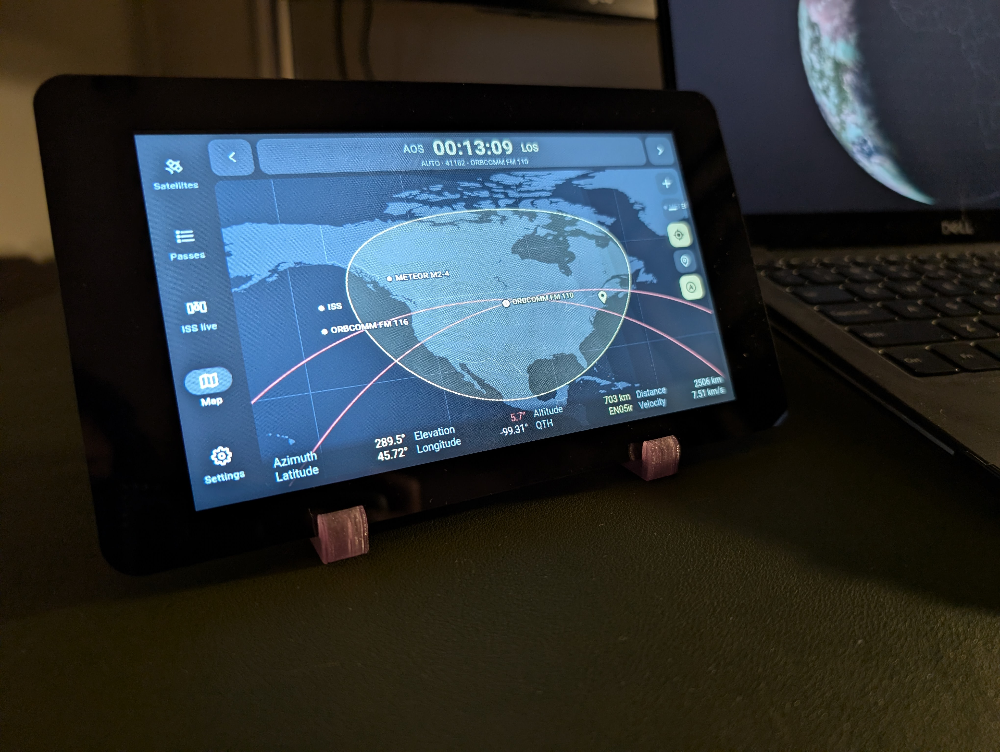
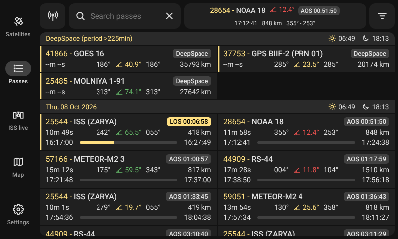
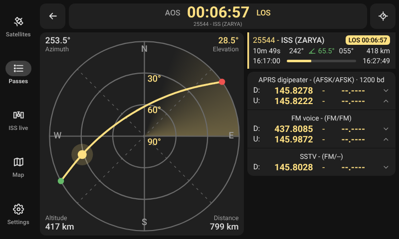
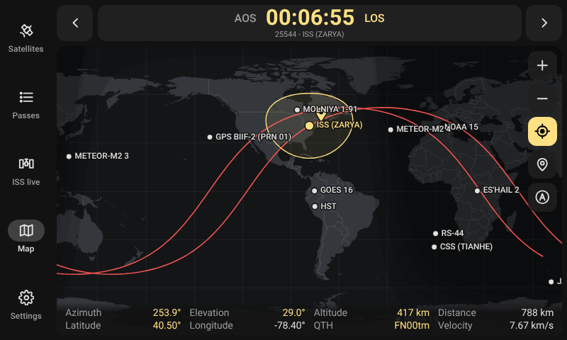
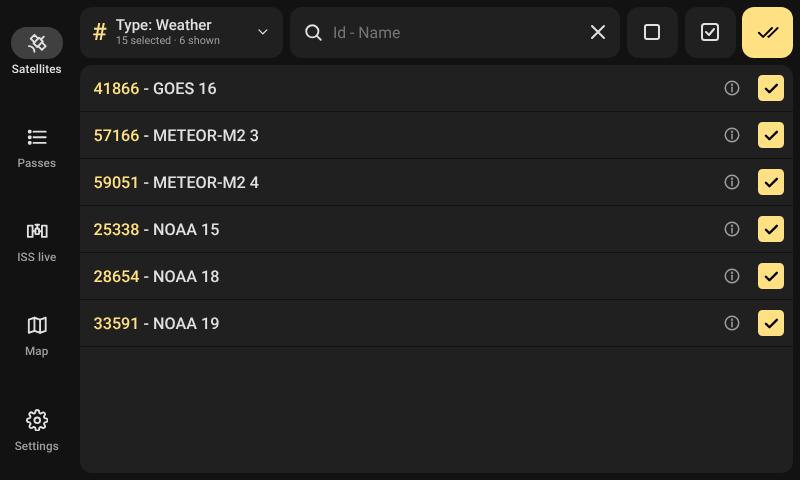
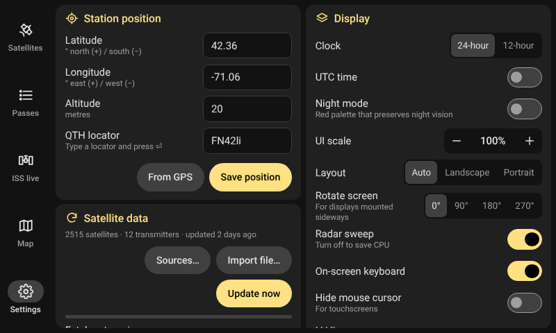
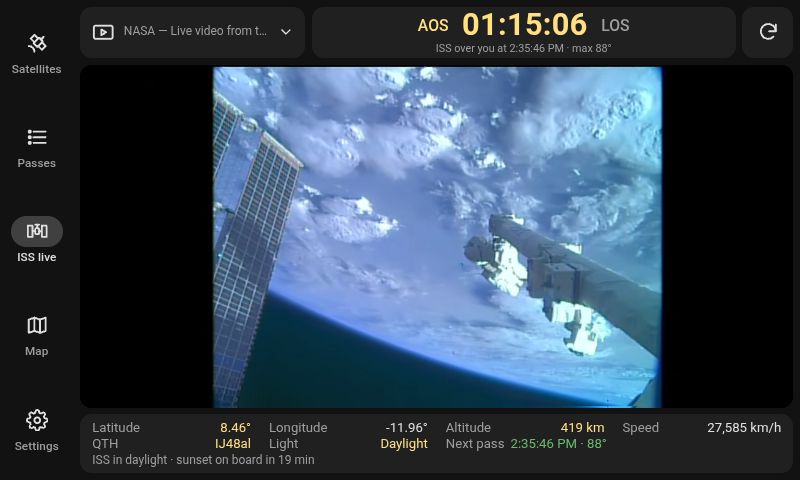

# Look4Sat rPi

A touch-friendly satellite tracker and pass predictor for Raspberry Pi OS. This is an independent port of the Android app [Look4Sat](https://github.com/rt-bishop/Look4Sat) by Arty Bishop. Features the same dark look and four core screens, **Satellites, Passes, Map, Settings**, plus a just-for-fun add-on, **ISS Live**.

It's designed for an 800×480 touchscreen in landscape, although the layout adapts to portrait and any other resolution.

<p align="center">
  <br>
  <sub><i>Look4Sat-rPi on a Raspberry Pi 7-inch touch display powered by a Raspberry Pi 5, running Raspberry Pi OS (supported by a 3D printed tablet stand).</i></sub>
</p>


## Screenshots

<table>
  <tr>
    <td></td>
    <td></td>
  </tr>
  <tr>
    <td align="center"><b>Passes</b>: upcoming passes grouped by day, with countdowns and elevation colours</td>
    <td align="center"><b>Radar</b>: live pass plot with doppler-corrected frequencies</td>
  </tr>
  <tr>
    <td></td>
    <td></td>
  </tr>
  <tr>
    <td align="center"><b>Map</b>: ground track, footprint, day/night and auto-track</td>
    <td align="center"><b>Satellites</b>: search and filter the whole catalog by type</td>
  </tr>
  <tr>
    <td></td>
    <td align="center"></td>
  </tr>
  <tr>
    <td align="center"><b>Settings</b>: station, data, display, radio and rotator</td>
    <td align="center"><b>ISS Live</b>: live feed from the ISS framed by tracking information</td>
  </tr>
</table>

<sub>Screenshots at 800×480.</sub>

## How it works

```
 ┌──────────────── Chromium (kiosk, full screen) ────────────────┐
 │  web/  — HTML/CSS/JS UI, no framework                          │
 │    satellite.js (SGP4/SDP4) for positions                      │
 │    passes.worker.js — pass prediction in a background thread   │
 └──────────────▲─────────────────────────────────────────────────┘
                │ http://127.0.0.1:8642
 ┌──────────────┴──── server.py (Python 3 stdlib only) ───────────┐
 │  settings + selection  → data/state.json                       │
 │  CelesTrak / AMSAT / SatNOGS download → data/catalog.json      │
 │  SatNOGS transmitters → data/radios.json                       │
 │  gpsd (position)  ·  rotctld (az/el)  ·  rigctld (frequency)   │
 └────────────────────────────────────────────────────────────────┘
```

* **No pip or npm installs.** It needs only Python 3 and Chromium, which ship with Raspberry Pi OS desktop. The satellite.js library, the Roboto font and a Natural Earth world map are bundled in `web/`.
* **Works offline.** After one data update, all calculations run on the Pi.

## Install on the Pi

You need Raspberry Pi OS **with desktop** (Bookworm or Trixie). A Pi 4 or 5 is recommended; a Pi 3B+ works but is slower.

```bash
git clone https://github.com/kampji/look4sat-rpi.git ~/Look4Sat-rPi
cd ~/Look4Sat-rPi
bash scripts/install.sh
```

The installer installs Chromium if it's missing and adds three menu entries and a `look4sat` command. **Nothing starts at boot, and nothing runs in the background**: the server runs only while the app is open.

| Start / stop | |
|---|---|
| Menu → **Look4Sat rPi** | Opens full screen (kiosk) |
| Menu → **Look4Sat rPi (window)** | Opens in a normal window (F11 or *Settings → System → Full screen* to toggle) |
| Menu → **Stop Look4Sat rPi** | Closes it from outside the app |
| *Settings → System → Quit* | Closes it from inside the app (works on a touchscreen in full screen) |
| `look4sat start` · `look4sat start --window` · `look4sat stop` · `look4sat status` | The same from a terminal or over SSH (with `DISPLAY`/`WAYLAND_DISPLAY` set for start) |

Closing the window in any of these ways also stops the server. Logs are in `~/.cache/look4sat-rpi/`.

On first start the app downloads satellite data, which takes about a minute. After that, set your position under **Settings → Station position**. Later starts refresh the data automatically once it is older than your *Auto update* setting (weekly by default).

| Installer option | Effect |
|---|---|
| `./scripts/install.sh --autostart` | Also opens full screen when you log in (undo by running the installer again without it) |
| `./scripts/install.sh --lan` | While it runs, a phone or laptop on your network can open `http://<pi-ip>:8642`. There is no password, so use this only on trusted networks. |
| `./scripts/uninstall.sh` | Removes the menu entries, command and autostart. Keeps the folder and your data. |
| `./scripts/run-dev.sh` | Runs only the server, on any Linux or Mac. Open the printed URL. |

**Recommended Pi settings:**
* *Raspberry Pi Configuration → Display → Screen Blanking: off* while you use it as a tracker.
* Keep the network connected, or use GPS with gpsd, so the clock stays accurate. The Pi has no RTC, and pass times depend on the clock.

## Screens

The bottom/side navigation follows the current Look4Sat layout: **Satellites · Passes · ISS Live · Map · Settings**. The Radar opens from a pass.

| Screen | What it does |
|---|---|
| **Satellites** | Searches the whole catalog by name or NORAD ID. Filters by **Type** (CelesTrak groups such as Amateur, Weather, NOAA, Starlink), and selects all shown or none. Tap a row to select it; tap ⓘ to see orbital elements, element age and transmitters. The ✓✓ button goes to Passes. |
| **Passes** | Matches the current Look4Sat Passes screen: |
| | • **Next-pass card** in the top bar, with an AOS/LOS countdown. Tap it to open the Radar. |
| | • **Search** passes by name or NORAD ID. |
| | • **Modes filter** (antenna button): only satellites with a transmitter in the chosen modes (FM, APT, CW…). |
| | • **Filter**: minimum elevation, time ahead, DeepSpace, elevation highlight thresholds, and an **AOS time window** (can be inverted). |
| | • Passes grouped by day under sticky headers showing **sunrise and sunset** at your station. |
| | • Each card shows an **AOS/LOS countdown chip**, duration, AOS az → max elevation → LOS az, altitude, and AOS/LOS times with a progress bar. |
| | • **Elevation color coding**: red below 15°, yellow in between, green from 45°. You can change both thresholds. |
| | • **Pull down** (finger or mouse) to recalculate. |
| **Radar** (tap a pass) | Shows a polar plot of the pass, the live position and an optional sweep, plus az/el/altitude/distance with color-coded elevation. Transmitters show **doppler-corrected** frequencies. The target button streams the pass to a rotator and radio. |
| **ISS Live** | Plays the ISS live video feed (NASA's official stream, Sen's 4K stream, NASA's current live video, or your own link). Below it: what the ISS is flying over right now (country and, for larger countries, state/province, or the sea/ocean) and where it will cross next; its position and speed; whether it is in **daylight or Earth's shadow** (and for how long, since the feed looks dark at night), and the next time it passes over you. The video runs only while this page is open. |
| **Map** | Shows all selected satellites, plus the ground track (red) and footprint (yellow) of the focused one, with day/night shading and your station. Tap a satellite to focus it, and use ‹ › to cycle. The tools are listed below. |
| **Settings** | Covers station position (lat/lon/alt, QTH locator, GPS), data sources and updates, file import, passes and elevation colors, display (24/12-hour clock, UTC, night mode, scale, layout, rotation), map layers, rotator, radio and gpsd, plus system controls (full screen, reload, quit) and **Associated projects**, which credits Arty Bishop's original Look4Sat with links (and QR codes to scan with a phone) to its GitHub repo and Google Play page. |

**Map tools** (top to bottom):

| Button | What it does |
|---|---|
| + / − | Zoom. You can also pinch, use the mouse wheel, double-tap, or **double-tap-and-drag** up/down (one-finger zoom that works with a mouse or single-touch screen). |
| ◎ Follow | Keeps the focused satellite centered (turning it on zooms in slightly so you can see it). Dragging the map turns it off. |
| 📍 Home | Centers the map on your station. |
| Ⓐ Auto-track | Follows the satellite currently passing over you, or the next one to rise, until its LOS, then hops to the next pass. It uses the same filters as the Passes list. The top bar shows `AUTO`. |

**Mouse or touch:** every list scrolls with a finger, or with click-and-drag (with momentum) when using a mouse or a touchscreen that behaves like one.

## Screen size, orientation and scaling

All sizes are in `rem`, and the root font size follows the screen's **short side**: 480 px gives 15 px text. This means the UI looks right on 800×480, 1024×600, 1280×720, 1920×1080 and so on.

* **Layout:** *Auto* picks a side rail in landscape and a bottom bar in portrait. You can force either.
* **Rotate screen 0/90/180/270°:** rotates the whole UI in software, touch included. Use it for a display mounted sideways when you can't or don't want to rotate it in the OS.
* **UI scale 60–200%:** adjusts the size on top of the automatic scaling.
* **Night mode:** an all-red palette for use outdoors at night.

To add a new layout, look for `.landscape` / `.portrait` in `web/css/app.css` and `applyLayout()` in `web/js/main.js`.

## On-screen keyboard

When you tap a text field, a built-in keyboard slides up, so no system keyboard is needed. Number fields get a numeric pad. If you type on a real keyboard, the on-screen one stops appearing for that session. You can also turn it off in Settings.

## Data sources

The defaults match Look4Sat. You can edit them in *Settings → Satellite data → Sources…*:

* CelesTrak `active` (OMM JSON), AMSAT `nasabare.txt`, SatNOGS DB TLEs
* SatNOGS active transmitters
* CelesTrak groups, used only to tag satellites with a type. You can turn this off for faster updates.

Supported formats are TLE, 3LE, OMM JSON, OMM CSV, SatNOGS JSON and Alpha-5 catalog numbers. When the same satellite appears in more than one source, the newest element set wins. Names come from the first source in the list.

To add your own satellites, drop `.txt`/`.tle`/`.json`/`.csv` files into `data/custom/` (or use *Import file…*), then press *Update now*.

CelesTrak asks users not to download the same data more than once every 2 hours, so auto-update is limited to daily or weekly.

## Rotator, radio and GPS (Hamlib / gpsd)

```bash
sudo apt install hamlib-utils gpsd
rotctld -m <model> -r /dev/ttyUSB0 &       # default port 4533
rigctld -m <model> -r /dev/ttyUSB1 &       # default port 4532
```

1. Turn on **Rotator (rotctld)** and/or **Radio (rigctld)** in Settings.
2. On the Radar screen, tap a transmitter to choose which downlink to tune.
3. Tap the target button to start tracking.

While tracking, the app sends `P az el` to rotctld and `F hz` (doppler-corrected, plus your offset) to rigctld about once per second.

**GPS (gpsd):** *From GPS* sets your station once. *Follow GPS position* keeps it updated as you move.

## Files

```
server.py            backend (stdlib only)
web/                 UI: index.html, css/app.css, js/*.js, vendor/satellite.esm.js
web/assets/world.json  Natural Earth 1:50m land, lakes and borders (simplified)
web/assets/regions.json  Natural Earth 1:50m countries, states/provinces and seas, for the ISS Live "Over" readout
data/                created at runtime: state.json, catalog.json, radios.json, custom/
scripts/             look4sat.sh (start/stop launcher), install, uninstall, run-dev
tests/fake_net.py    runs the server against synthetic offline data
tests/shots.py       Playwright screenshots of every screen at any size
```

## Accuracy

Pass search uses an adaptive coarse scan, bisection to 1 s for AOS and LOS, and a golden-section search for maximum elevation. Compared with a brute-force 1-second scan over 24 hours (15 satellites from LEO to Molniya, 0° minimum), it missed no passes. AOS and LOS were within about 2 s, and maximum elevation within 0.01°.

## Credits

* [Look4Sat](https://github.com/rt-bishop/Look4Sat) by Arty Bishop (GPL-3.0), the inspiration for the design and features. No code was copied.
* [satellite.js](https://github.com/shashwatak/satellite-js) (MIT): SGP4/SDP4.
* [Natural Earth](https://www.naturalearthdata.com/): public-domain map, country and sea data.
* [QR Code generator](https://www.nayuki.io/page/qr-code-generator-library) by Project Nayuki (MIT).
* [Roboto](https://fonts.google.com/specimen/Roboto) (OFL).
* Orbital data from [CelesTrak](https://celestrak.org), [AMSAT](https://www.amsat.org) and [SatNOGS](https://satnogs.org).
* [Raspberry Pi 7-inch Touch Display](https://www.raspberrypi.com/products/raspberry-pi-touch-display/)
* [Raspberry Pi 5](https://www.raspberrypi.com/products/raspberry-pi-5/)
* [Raspberry Pi OS (64-bit)](https://www.raspberrypi.com/software/operating-systems/)
* 3D Printed [Universal Tablet Stand](https://www.thingiverse.com/thing:1706937) by Slajmich on Thingiverse (CC BY 4.0)